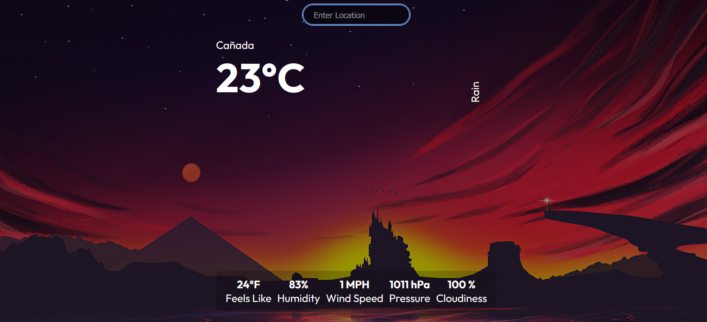

An API based weather application build using React JS and openweather API for real time monitoring of weather forecast based on the current location.

Technologies used :
React JS 
OpenWeather API

Screenshots:

To run: 

*CLone this repo to local system

*Open terminal

*Type "npm start" 

